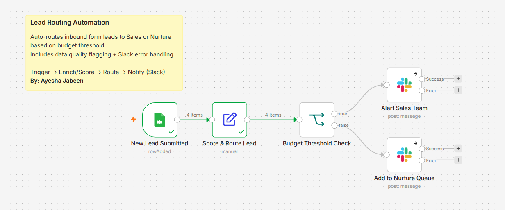
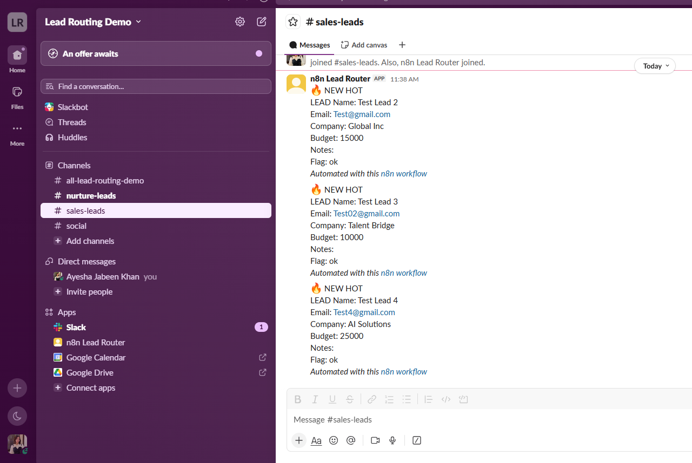
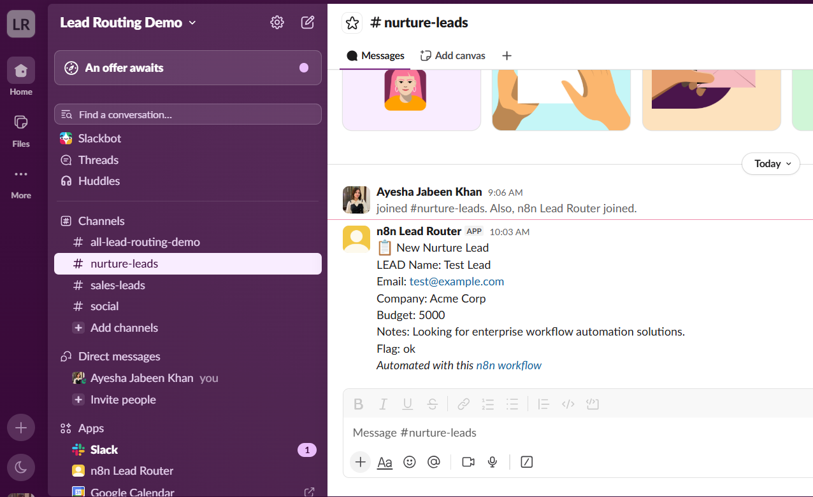

# Lead Routing Automation (n8n)

Automates lead intake, scoring, and Slack notification routing based on budget threshold — eliminates manual lead triage from a form submission to a sales alert.

## Workflow

1. Lead submits a form (Google Forms) → response lands in Google Sheets
2. n8n polls the sheet for new rows
3. Lead is scored (Hot/Warm) and a data-quality flag is applied
4. Budget threshold check routes the lead:
   - ≥ $10,000 → `#sales-leads` Slack channel
   - < $10,000 → `#nurture-leads` Slack channel
5. Slack delivery includes error-branch handling (Continue On Fail)

## Result

| Sales Lead Alert | Nurture Lead Alert |
|---|---|
|  |  |

## Stack
- n8n (self-hosted)
- Google Sheets API
- Slack API (OAuth2, `chat:write` scope)

## Setup
1. Import `lead-routing-automation.json` into your n8n instance
2. Connect your own Google Sheets and Slack credentials
3. Update the budget threshold in the "Score & Route Lead" node if needed

## Notes
Built as a portfolio demo with test data. Threshold, scoring logic, and
notification channels are easily adapted for a real pipeline (e.g. CRM
write-back, SMS alerts, multi-tier routing).
